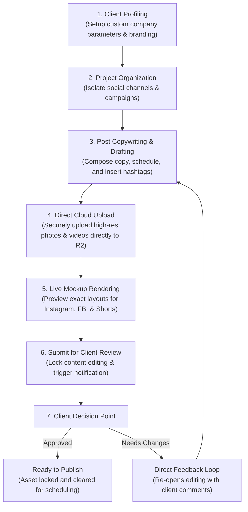
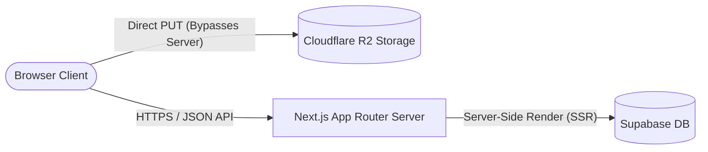

# ContentFlow: The Simple Way to Approve & Manage Social Content
### *What is ContentFlow and how does it work?*

---

## What is ContentFlow?

Let’s be honest: trying to get social media posts approved by clients using endless email chains, random Slack messages, and messy spreadsheets is a headache. Posts get lost, clients get confused, and mistakes happen.

**ContentFlow** is a simple, beautiful workspace that brings your entire content approval process into one place. Creators can draft posts and upload high-res media, and clients can preview exactly how their posts will look on social media and approve them with a single click. No mess, no stress.

---

## A Quick Tour of the Website

ContentFlow is split into three simple, friendly spaces depending on who is using it:

### 1. Your Agency Dashboard (Your Creative Headquarters)
This is where your team hangs out. As soon as you log in, you get a clean, modern dashboard where you can:
*   **Manage Clients:** Easily set up profiles and contact info for all the businesses you work with.
*   **Organize Projects:** Group campaigns, post drafts, and schedules cleanly by client so nothing gets mixed up.
*   **Track Progress:** See who has approved what and what posts still need a client look-over at a quick glance.

### 2. The Post Creator (Where the Magic Happens)
The ultimate playground for your content creators. Staging a new post is super smooth:
*   **Draft in Seconds:** Write your captions, schedule the best time to publish, and throw in your hashtags.
*   **Direct Cloud Upload:** Drag and drop massive video files or high-res photos (up to 500MB!) and watch them stream directly to our secure cloud with a fast progress bar.
*   **Live Previews:** See exactly how the post will look on Instagram, Facebook, or YouTube Shorts before you send it to the client.

### 3. The Client Portal (Your Client's Happy Place)
A private, beautifully simple page built just for your clients. They don't need any training to use it:
*   **One-Click Approvals:** Clients can open their private link, look at the post mockup, and click "Approve" if it looks good, or "Request Changes" if it needs a tweak.
*   **Easy Comments:** If they want changes, they can leave feedback directly on the post card so your team knows exactly what to fix.
*   **Total Privacy:** Clients only see their own campaigns—keeping everything secure and professional.

---

## The Core Value Proposition

> [!NOTE]  
> **Efficiency Benchmark:** By migrating from scattered approval channels to ContentFlow, agencies typically experience a **70% reduction in client feedback cycle times** and a total elimination of publishing errors caused by mismatched media previews.

| Operation Pain Point | The ContentFlow Solution |
| :--- | :--- |
| **Fragmented Communication** Feedback and change requests are scattered across threads. | **Centralized Approvals** Clients approve or request revisions directly on individual post assets. |
| **Silent Media Upload Failures** High-definition video uploads fail due to standard server limits. | **Direct-to-Cloud Uploads** Bypasses server bottlenecks entirely, supporting files up to 500MB with live progress. |
| **Discrepancies in Rendering** Content creators cannot see how assets render until they are live. | **High-Fidelity Mockups** Pixel-perfect real-time rendering for Instagram, Facebook, and Shorts. |

---

## Content Production & Approval Lifecycle

The workflow below outlines how ContentFlow manages content from initial draft to locked client approval in a clean, vertical pipeline:

---

## Core Product Capabilities

### 1. Multi-Tenant Client & Workspace Isolation
*   **Dedicated Environments:** Separate client data completely, ensuring absolute data privacy.
*   **Glassmorphic Interface Modals:** Responsive overlay systems allow project managers to add clients and create projects instantly without page reloads.
*   **Safe Structural Deletions:** Custom confirmation systems ("Are you sure?") prevent accidental deletion of critical client histories.

### 2. High-Fidelity Platform Rendering
*   Eliminate the guesswork of content creation. The live preview engine displays exact platform-specific layouts in real time, simulating text wrapping, aspect ratios, and media styling for:
    *   **📷 Instagram Grid & Feed**
    *   **📘 Facebook Post UI**
    *   **🎬 YouTube Shorts & Instagram Reels**

### 3. Direct-to-Cloud Media Pipeline
*   **Cloudflare R2 Object Storage:** Large-scale files bypass standard hosting limitations entirely by generating S3-compatible presigned upload links.
*   **Real-time Progress Indicators:** Keeps creators informed during large video uploads with a visual percentage progress bar.

---

## Technical Infrastructure & Performance

### Direct-to-Cloud Presigned Uploads
Traditional servers limit file uploads to under 5MB, which completely blocks modern high-definition social video. ContentFlow implements a high-performance cloud upload architecture:
1.  **Presign Request:** The browser client requests a secure, time-limited signature from the server API (a micro-request taking under 50ms).
2.  **Direct-to-Cloud PUT:** The browser client streams the file bytes directly from the user's local drive to Cloudflare R2.
3.  **Result:** Zero load on the application server, 100% upload success rates for large media files (up to 500MB), and absolute scalability.

### Enterprise-Grade Security & Isolation
> [!IMPORTANT]  
> ContentFlow implements database-level **Row Level Security (RLS)**. This guarantees that client accounts can only access information explicitly assigned to them, establishing a robust security posture ideal for enterprise clients.

---

## Client Return on Investment (ROI)

*   **Accelerated Delivery Cycles:** Consolidating previews, media uploads, and feedback loops into one hub saves hours of administrative time per project weekly.
*   **Brand Value Elevation:** Impress your clients with a premium, bespoke portal, establishing your agency as a forward-thinking, high-tech partner.
*   **Quality Assurance:** What your client approves is exactly what gets published—minimizing post-publishing deletions and public relations mistakes.
*   **Scalable Framework:** Ready to support hundreds of active client accounts and multi-terabyte asset storage volumes out of the box.
